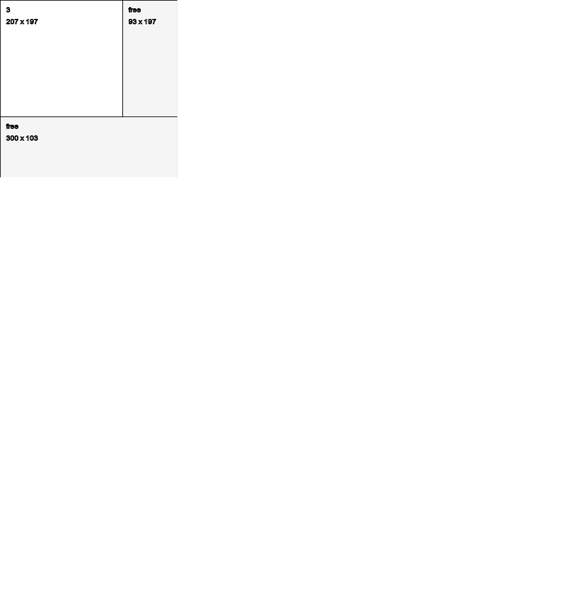

# bin-packer
2D bin packing for PHP, with rotation and growth function

## Usage
### Basic

```php
$bin = new Bin(1000, 1000);
$blocks = [
    new Block(100, 100),
    new Block(300, 100),
    new Block(175, 125),
    new Block(200, 75),
    new Block(200, 75),
];

$packer = new BinPacker();

$blocks = $packer->pack($bin, $blocks);
```

#### Determining the result (was a block packed?)

```php
foreach ($blocks as $block) {
    if ($block->getNode() && $block->getNode()->isUsed()) {
        // packed
    }
}
```

### Rotation

By default, all blocks are allowed to rotate. Rotation occures only if a fit is not found with the initial orientation.

You can disable rotation by passing `false` as the 3rd parameter to the block's constructor.
```php
new Block(100, 100, false);
```

### Identifying blocks

Sometimes it can be useful to set an identifier for the block. The optional 4th parameter of the constructor is the block ID.

```php
new Block(100, 100, false, 'My id, can be anything.');
```

### Bin growth

By allowing the bin to grow, you can fit all blocks, every time.

You can enable growth by passing `true` as the 3rd parameter to the bin's constructor.
```php
$bin = new Bin(1000, 1000, true);
```

## Visualizer

You can use the visualizer to create pictures of the packed bin.

```php
$bin = new Bin(1000, 1000);
$blocks = [
    new Block(100, 100),
    new Block(300, 100),
    new Block(175, 125),
    new Block(200, 75),
    new Block(200, 75),
];

$packer = new BinPacker();

$blocks = $packer->pack($bin, $blocks);

$image = $visualizer->visualize($bin, $blocks);
```

This feature uses the Imagick extension, and returns an \Imagick class. You can use the result to save, or display the image.

```php
$image->setFormat('jpg');
$image->writeImage('bin.jpg');
```


## GIF creator

**WARNING**
The GIF creators performance is very slow. I would suggest only using it for debug purposes, or non real-time scenarios

```php
$packer = new BinPacker();
$gifMaker = new GifMaker(new Visualizer());

$blocks = $packer->pack($bin, $blocks, $gifMaker);

$gif = $gifMaker->create();

$gif->writeImages('bin.gif', true);
```


